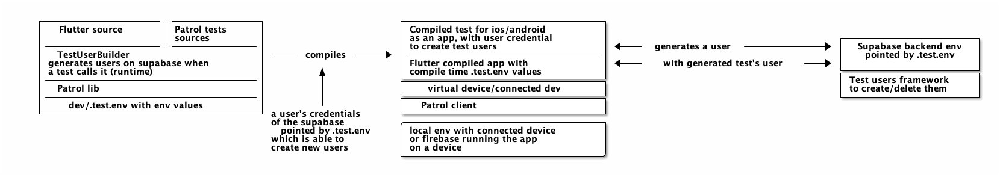

# Gmadrid Natación App

A helper app for the [Gmadrid Natación](https://www.gmadridsports.com/club-de-natacion-madrid/) swimming section club.
This is a mono-repo, containing both the frontend and the backend.

The backend is based on [supabase](https://supabase.io/), a firebase-like service, but open source and self-hostable.

The frontend is a flutter app, with a focus on Android and iOS platforms.

<p align="center">
    
</p>

## Setup
Needed:
- Apple developer program, or at least being part of the team
- XCode ~14.2
- Docker for supabase (backend support)
- A firebase account (testLab, push notifications and crash loggings)
- Apple certificates bound to the provisioning profiles (autosign is disabled)
- java-sdk (recommended by using jenv): currently using `temurin64-18.0.2.1`
- Flutter

### Backend local
Install [supabase cli](https://supabase.com/docs/guides/cli)
```bash
brew install supabase/tap/supabase
```

### Flutter
Follow the installation guide for your OS (MacOS recommented, otherwise you can't develop the iOS version) on [https://docs.flutter.dev/get-started/install](https://docs.flutter.dev/get-started/install)

I recommend using brew to install it:
```bash
brew install flutter
```

As a last step, in order to see if everything is intalled correctly, run:
```bash
flutter doctor
```

### Firebase
todo

### Makefile
A makefile can help you with the most common tasks. You can see all the available commands by typing:
```bash
make list
```
When setting up the project you may be interested in:
```bash
# initializes the supabase project locally (DB, bucket files etc)
make backend-setup

# installing all the dependencies for the frontend
make frontend-setup

# It sets up a pre-commit hook that helps with the tests. See the tests section below for more info.
# Not needed, but recommended.
make setup-pre-commit
```

## Tests
### Frontend
Mainly focused on e-2-e tests. Tests are executed with `patrol` lib, in place of the default `integration_tests` one, in order to have the full control on the device (accepting notification dialogs etc.) when performing remotely.

Tests can be executed locally with a connected device/running simulator, as well as remotely on Firebase Test Lab.

<!-- [source](dev/doc/test-1.md) -->


The app uses its own environment defined by `assets/.test.env` when compiling and running e-2-e tests. This is especially needed for firebase tests: since they run on real physical devices, no sidecar-backend can be used on the same machine. This means that the app must be able to connect to a real backend, and not to a local one.

On the other hand this gives us the chance of fully testing the app, without having to mock anything.

#### Test users
The need: we want to execute tests with a real backend and users representing the use-case scenario we need (membership level etc).

The problem: 
- user and password would be hardcoded in the artifacts running on external devices (firebase etc), which is not a good practice. Even worse test artifact could be published publicly;
- we don't want to generate users while compiling the test artifacts: we should generate the artifacts each time we want to run them otherwise. We want them re-runnable/reusable (more about it [ test on CI](#tests-on-ci)).
 
The solution:
- A `TestUserBuilder` called by patrol's test interacts with the supabase's backend to create/delete users when needed. This is done at runtime, so the credentials are not hardcoded in the artifacts;
- Supabase test env is set up with a RPC function that `TestUserBuilder` can call along with a specific user/pass used only to generate users. no more actions are allowed for the user;
- When compiling the test artifacts, the only one user/pass credentials compiled are the ones used to call the testing users' generation. Not fully safe, but relatively;
- Users are created with a uuid as a username: collision is highly improbable.

The user testing framework needed on the supabase's testing environment can be manually set up by using [this sql script](./dev/tests/env/test-framework.sql).

#### Tests on local
Check if the `assets/.test.env` contains the correct values for you: backend url, supabase project id, test accounts path etc.

You simply need to have a connected device (or a running simulator) and run:

```bash
make test-local
```
#### Tests on firebase
Some helper make options are available to compile and send the tests to firebase:

```bash
make test-flutter-android
make test-flutter-ios
```

This both compile and send the tests to firebase. You can also compile the tests locally and send them to firebase manually:
```bash
make test-build-artifact
```

---
**‼️ Heads up!**
The artifacts will contain test credentials for the user used to call the function which generates new users. This means that you should not share them publicly nor committing them in this repo.

--- 
 
#### Tests on CI
When a PR is opened, the tests are built and executed on firebase. 
The problem: 
- due to the (free) limited resources, it'd be better off reusing already-compiled tests locally.
- since test artifacts have test environment credentials compiled, they cannot be shared publicly on this repo (or other public repos).

The solution: github action as well as `make test-flutter-android` and `make test-flutter-ios` check if the test artifacts for the specific commit are present on a private server. If they are, they are downloaded and used. Otherwise, they are compiled and sent to firebase.

To create a new artifact:


To execute a test by exploiting already build artifacts:


```bash
# it compiles the tests and sends them to a private server
make test-artifacts-push

# they will check if we have the latest tests on local, otherwise they will build it 
make tests-flutter-android
make tests-flutter-ios
```

In order to make this work, you need to set up the private server info by running:
```bash
make setup-pre-commit
```

To compile and push the test artifacts you can run:
```bash
make push-test-artifacts
```

#### Pre-commit helper
In order to generate and push the test build artifacts you can use the pre-commit hook. For each commit:

- it builds the test artifacts
- it pushes them to the private server

```bash
make setup-pre-commit
```

---
**🧐 Hint**
If you are in a hurry, you can skip the pre-commit hook by using the flag:
```bash
git commit --no-verify 
```

but keep in mind that the PR will have to build them, by using CI resources.

--- 

### Backend tests
The DB is tested with pgTAP.

```bash
make test backend
```

All the tests are under [`supabase/tests/database`](./supabase/tests/database)

### Tests on PRs
Frontend (Firebase's tests) as well as backend (locally) are executed automatically by github actions when a PR is opened.

#### Local optimization when committing
In order to save CPU times on github actions (especially the iOS one), a pre-commit git hook can help to build locally the test builds' to be executed. This way, github actions' will simply have to call firebase's test lab, without having to compile the app.

To enable it:
```bash
make setup-pre-commit-template
```

Once you have it, you can use it by simply committing. Keep in mind that you will have to wait for the builds to be generated, so it will take some time.

If you are in a hurry, you can skip the pre-commit hook by using the flag:
```bash
git commit --no-verify 
```

## Author
Matteo Bertamini [www.bertamini.net](https://www.bertamini.net)