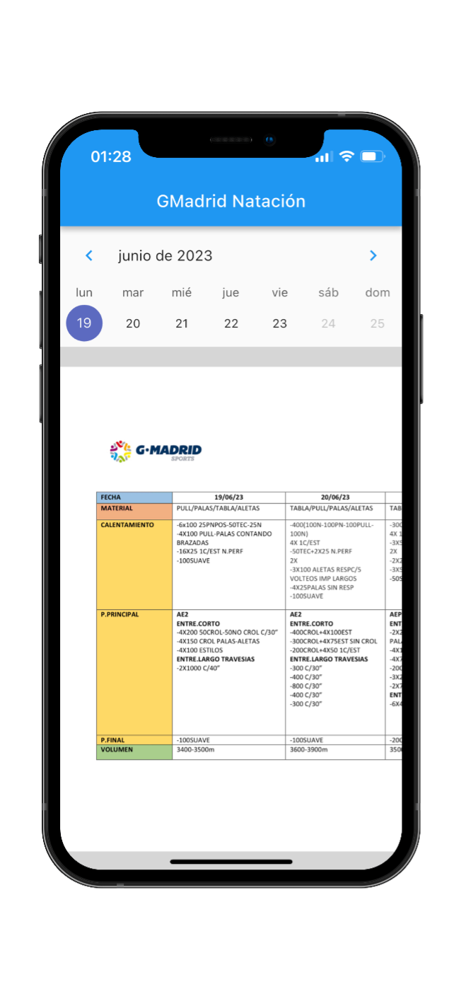

# Gmadrid Natación App

A helper app for the [Gmadrid Natación](https://www.gmadridsports.com/club-de-natacion-madrid/) swimming section club.
This is a mono-repo, containing both the frontend and the backend.

The backend is based on [supabase](https://supabase.io/), a firebase-like service, but open source and self-hostable.

The frontend is a flutter app, with a focus on Android and iOS platforms.

<p align="center">
    
</p>

## Setup
Needed:
- Apple developer program, or at least being part of the team
- XCode ~14.2
- Docker for supabase (backend support)
- A firebase account (testLab, push notifications and crash loggings)
- Apple certificates bound to the provisioning profiles (autosign is disabled)

### Supabase local
Install [supabase cli](https://supabase.com/docs/guides/cli)
```bash
brew install supabase/tap/supabase
```

[Start supabase](https://supabase.com/docs/guides/cli/local-development)
```bash
supabase login
```

### Firebase
todo

### Makefile
A makefile can help you with the most common tasks. You can see all the available commands by typing:
```bash
make list
```

To set everything up you may be interested in:
```bash
# see the tests section below for more info
make setup-pre-commit

# initializes the supabase project locally (DB, bucket files etc)
make backend-setup

# installing all the dependencies for the frontend
make frontend-setup
```

## Tests
### Frontend
Mainly focused on e-2-e tests. Tests are executed with `patrol` lib, in place of the `integration_tests` one, in order to have full control on the device (accepting notification dialogs etc.) when performing remotely.

Tests can be executed locally as well as remotely on Firebase Test Lab.

e-2-e tests use its own backend, defined by `assets/.test.env`. A local supabase insatance cannot be used, since firebase's test lab could not access it.

```bash
# compile tests locally and send it to firebase to be executed
make test-flutter-android
make test-flutter-ios

# everything is executed locally. A connected device (or a running virtual one) is needed
make test-local
```

### Backend
The DB is tested with pgTAP.

```bash
make test backend
```

All the tests are under [`supabase/tests/database`](./supabase/tests/database)

### Tests on PRs
Frontend (Firebase's tests) as well as backend (locally) are executed automatically by github actions when a PR is opened.

#### Local optimization when committing
In order to save CPU times on github actions (especially the iOS one), a pre-commit git hook can help to build locally the test builds' to be executed. This way, github actions' will simply have to call firebase's test lab, without having to compile the app.

To enable it:
```bash
make setup-pre-commit-template
```

Once you have it, you can use it by simply committing. Keep in mind that you will have to wait for the builds to be generated, so it will take some time.

If you are in a hurry, you can skip the pre-commit hook by using the flag:
```bash
git commit --no-verify 
```

## Author
Matteo Bertamini [www.bertamini.net](https://www.bertamini.net)